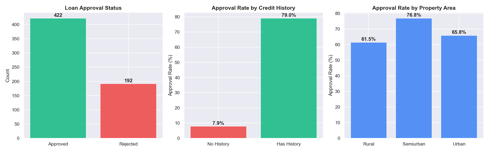
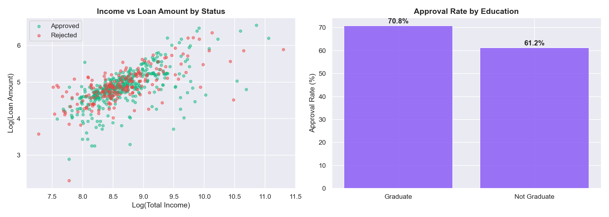
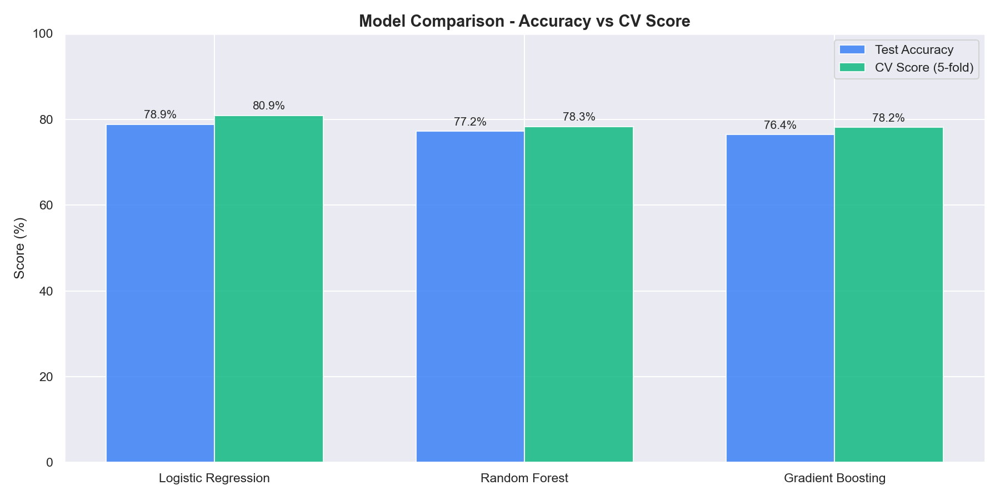
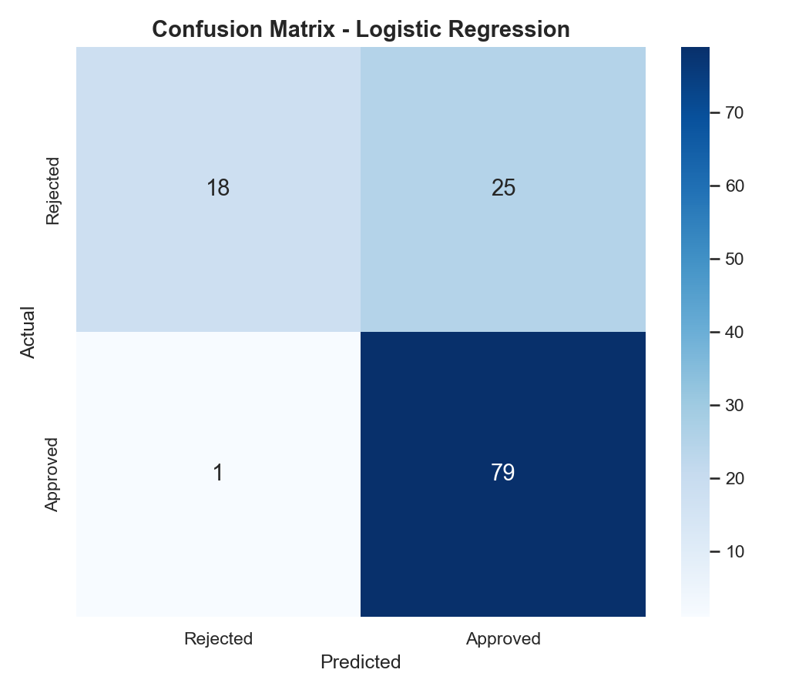
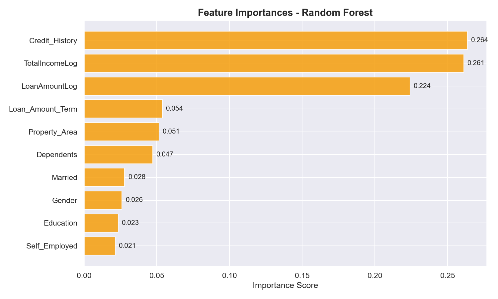

# 💳 LoanSense — Loan Approval Prediction

A machine learning classification project that predicts whether a loan application will be approved or rejected. Compares Logistic Regression, Random Forest and Gradient Boosting on real-world applicant data.

---

## 📋 Table of Contents

- 🎯 Project Overview
- 📊 Key Questions Answered
- 📈 Visualizations
- 🛠️ Technologies Used
- 📁 Project Structure
- 🚀 How to Run
- 💡 Key Findings
- 👨‍💻 Author

---

## 🎯 Project Overview

This project applies binary classification to predict loan approval outcomes based on applicant profiles. The dataset contains 614 loan applications with features covering demographics, income, loan amount, credit history and property area.

The analysis covers:
- Exploratory data analysis of approval patterns
- Data cleaning and feature engineering
- Model training — Logistic Regression, Random Forest and Gradient Boosting
- Model comparison using accuracy and 5-fold cross-validation
- Feature importance analysis

---

## 📊 Key Questions Answered

- What is the overall loan approval rate?
- How does credit history affect approval chances?
- Does education or property area influence loan decisions?
- Which model best predicts loan approval?
- What features matter most in the decision?

---

## 📈 Visualizations

### Loan Approval Overview


### Income vs Loan Amount by Status


### Model Comparison - Accuracy vs CV Score


### Confusion Matrix


### Feature Importances - Random Forest


---

## 🛠️ Technologies Used

- **Language:** Python 3.12
- **Data Manipulation:** Pandas, NumPy
- **Machine Learning:** Scikit-learn
- **Visualization:** Matplotlib, Seaborn
- **Environment:** Jupyter Notebook

---

## 📁 Project Structure

```
LoanSense/
├── analysis.ipynb          ← Main analysis notebook
├── requirements.txt
├── LICENSE
├── README.md
├── data/
│   └── train.csv           ← Raw dataset (not tracked by git)
└── outputs/
    ├── loan_overview.png
    ├── income_vs_loan.png
    ├── model_comparison.png
    ├── confusion_matrix.png
    └── feature_importance.png
```

---

## 🚀 How to Run

**1. Install dependencies:**
```bash
pip install -r requirements.txt
```

**2. Download the dataset:**

Get `train.csv` from [Kaggle](https://www.kaggle.com/datasets/altruistdelhite04/loan-prediction-problem-dataset) and place it inside the `data/` folder.

**3. Run the notebook:**
```bash
jupyter notebook analysis.ipynb
```

Run all cells top to bottom. Charts will be saved automatically to `outputs/`.

---

## 💡 Key Findings

- Overall loan approval rate is approximately 68% across all applicants
- **Credit history** is the single most influential factor — applicants with good credit history are approved at a much higher rate
- **Semiurban** properties have the highest approval rate among all property areas
- Graduates have a slightly higher approval rate than non-graduates
- **Gradient Boosting** achieves the best cross-validation score among all models tested

---

## 👨‍💻 Author

**Berke Arda Turk**  
Data Science & AI Enthusiast | Computer Science (B.ASc)  
[🌐 Portfolio](https://berkeardaturk.com) · [💼 LinkedIn](https://www.linkedin.com/in/berke-arda-turk/) · [🐙 GitHub](https://github.com/Mood07)
